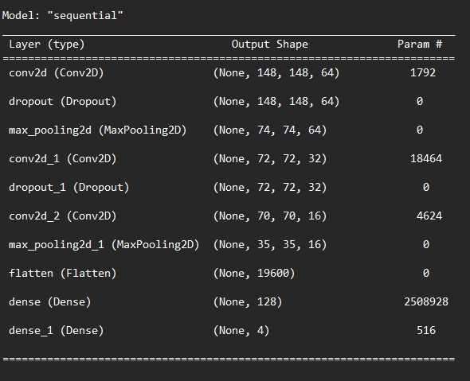

# Progetto di Tesi

**Valutazione della degenerazione del
morbo di Parkinson mediante modello
di rete neurale convoluzionale**

Candidato:
* Elpidio Mazza

Relatore: 
* Prof. Rita Francese
* Dott.ssa Maria Frasca
---

### **UNIVERSITÀ DEGLI STUDI DI SALERNO**


### **Dipartimento di Informatica**

**Corso di Laurea Triennale in Informatica**

---

### Dataset

Numero di esempi per il training: 8740
NUmero di esempi per il test: 2210
Ogni immagine è di dimensione (150, 150)


---

### CNN




---

# How to run in local

Per far funzionare il progetto in locale bisogna installare tutti i moduli requisiti.

```
pip install -r requirements.txt
```


### Hosted by Heroku

[Link al sito](https://app-cnn-flask.herokuapp.com/)

---

## Run with GPU and requirments

Cambiare nel file requirments.txt

```
from ---> tensorflow-cpu==2.9.1

to ---> tensorflow==2.9.1
```

Se si posside una GPU, il modulo tensorflow-cpu è stato utilizzato per il deploy su Heroku.

Alcuni requirments sono stati rimossi per diminuire il peso della build.

---

# Contenuti

<div>
<p float="left">
   
  
</p>
</div>
